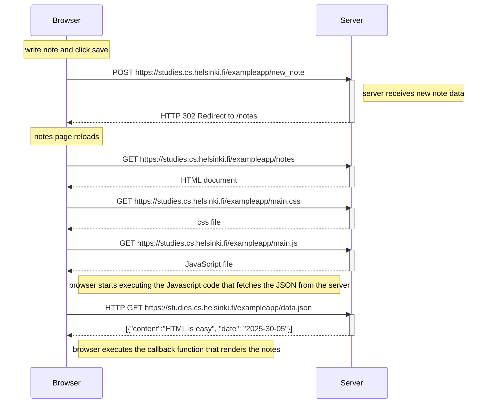
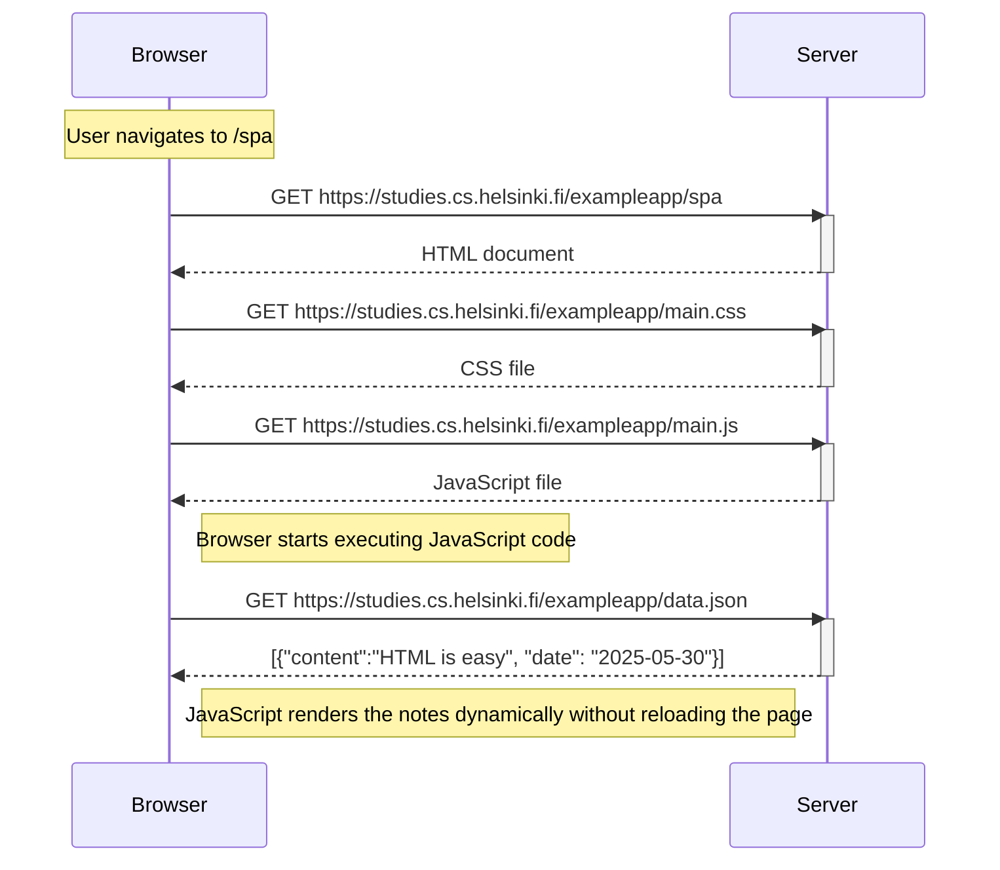
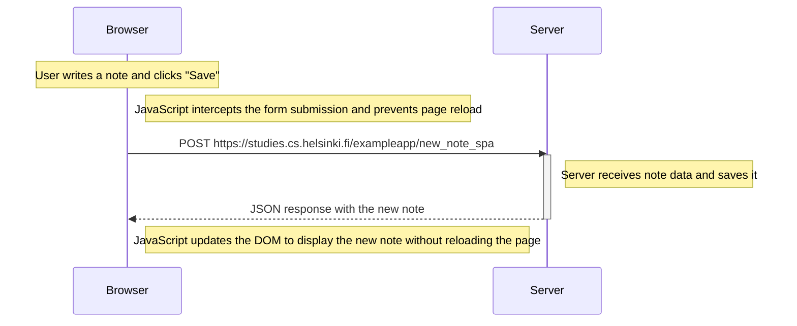

# Full Stack Open - Part 0 Exercises

## 0.4: Diagram - New note created in traditional app

```mermaid
sequenceDiagram
    participant Browser
    participant Server

    Note over Browser: write note and click save
    Browser->>Server: POST https://studies.cs.helsinki.fi/exampleapp/new_note
    activate Server
    Note right of Server: server receives new note data
    Server-->>Browser: HTTP 302 Redirect to /notes
    deactivate Server

    Note over Browser: notes page reloads
    Browser->>Server: GET https://studies.cs.helsinki.fi/exampleapp/notes
    activate Server
    Server-->>Browser: HTML document
    deactivate Server

    Browser->>Server: GET https://studies.cs.helsinki.fi/exampleapp/main.css
    activate Server
    Server-->>Browser: css file
    deactivate Server
    
    Browser->>Server: GET https://studies.cs.helsinki.fi/exampleapp/main.js
    activate Server
    Server-->>Browser: JavaScript file
    deactivate Server
    
    Note right of Browser: browser starts executing the Javascript code that fetches the JSON from the server

    Browser->>Server: HTTP GET https://studies.cs.helsinki.fi/exampleapp/data.json
    activate Server
    Server-->>Browser: [{"content":"HTML is easy", "date": "2025-30-05"}]
    deactivate Server
    Note right of Browser: browser executes the callback function that renders the notes
```

## 0.5: Diagram – User visits the Single Page App

```mermaid
sequenceDiagram
    participant Browser
    participant Server

    Note over Browser: User navigates to /spa

    Browser->>Server: GET https://studies.cs.helsinki.fi/exampleapp/spa
    activate Server
    Server-->>Browser: HTML document
    deactivate Server

    Browser->>Server: GET https://studies.cs.helsinki.fi/exampleapp/main.css
    activate Server
    Server-->>Browser: CSS file
    deactivate Server

    Browser->>Server: GET https://studies.cs.helsinki.fi/exampleapp/main.js
    activate Server
    Server-->>Browser: JavaScript file
    deactivate Server

    Note right of Browser: Browser starts executing JavaScript code

    Browser->>Server: GET https://studies.cs.helsinki.fi/exampleapp/data.json
    activate Server
    Server-->>Browser: [{"content":"HTML is easy", "date": "2025-05-30"}]
    deactivate Server

    Note right of Browser: JavaScript renders the notes dynamically without reloading the page
```

## 0.6: Diagram – New note in Single Page App

```mermaid
sequenceDiagram
    participant Browser
    participant Server

    Note over Browser: User writes a note and clicks "Save"
    Note right of Browser: JavaScript intercepts the form submission and prevents page reload

    Browser->>Server: POST https://studies.cs.helsinki.fi/exampleapp/new_note_spa
    activate Server
    Note right of Server: Server receives note data and saves it
    Server-->>Browser: JSON response with the new note
    deactivate Server

    Note right of Browser: JavaScript updates the DOM to display the new note without reloading the page

```